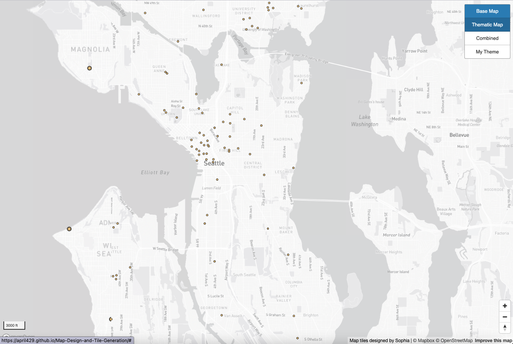
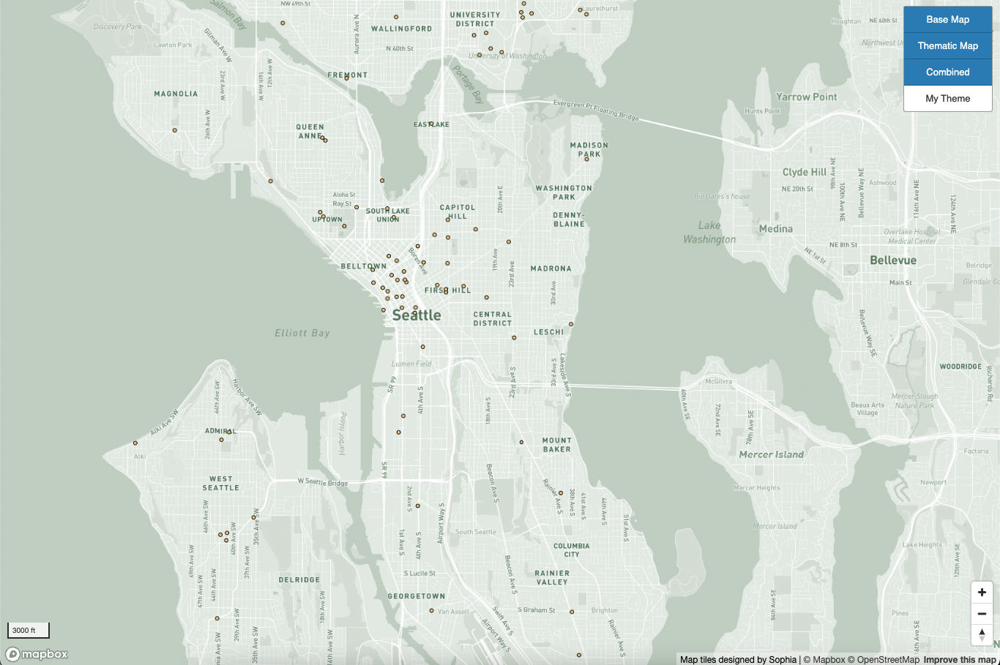
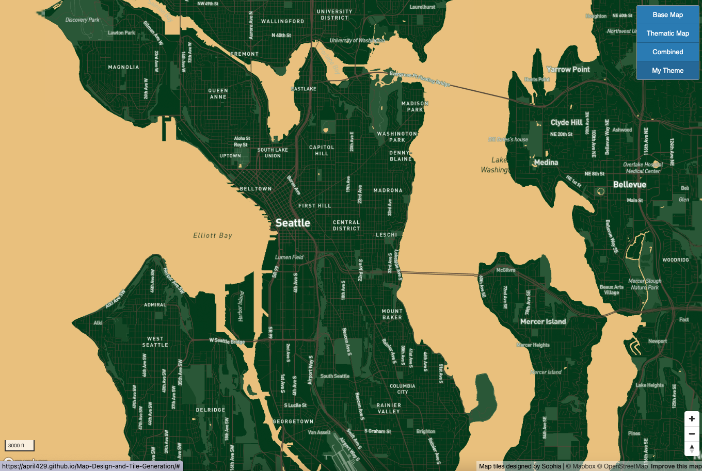

# Map-Design-and-Tile-Generation

### [Lab04 Webpage URL](https://april429.github.io/Map-Design-and-Tile-Generation/)

## Examined Geographic Area
- City : Seattle
- Starting Center Point & Zoom Level : Starting center at downtown Seattle (-122.3, 47.6) with starting zoom with 11.7 level for all 4 tileset. My tileset ranges from minimum 3 to maximum 14 for all four tilesets, so you can vividly see Seattle with the zoom level of 11.7.
- Web page elements : I added scale bar and zoom control on the left and right bottom of the web map along with the layers button you can choose to see 4 different maps.

## 4 Tilesets & Description

- Zoom level : minimum 3, maximum 14
- Description : It's a monochrome base map provided by MapBox with some modifications to fonts, size, icon to airport. I changed the monochrome color to grayish khaki with some labels changed to bigger, bolder fonts. Since its primary funcition is to deliver geographic context of the area, I didn't make too much chnages, but tried to focused on simplicity and unity that represents Seattle's evergreen and grayish city vibe. You can view Seattle well within the zoom level range here with the starting zoom level.

- Zoom level : minimum 5, maximum 14
- [Data URL](https://www.kaggle.com/datasets/kukuroo3/starbucks-locations-worldwide-2021-version?resource=download)
- Description : It's a thematic map made by my own geospatial dataset of Starbucks locations in Seattle with 2021 version. I choose Starbucks dataset since I love coffee! The original dataset continas worldwide location of Starbucks, but I cleaned up the dataset to only include Seattle locations which is my interest area. Each dots represent starbucks locations with gold color which is one of the Starbucks color with outline color of black to make it more visible cmopared to the base map. Here, I used different zoom level between 5 and 14 since I'm showing data points so I made a little variations.

- Zoom level :minimum 3, maximum 14
- Description : It's a combined map compromised of the first(base map) and the second(thematic map) tilesets. With the grayish Khaki base map and more recognizable fonts along with the vivid gold color of dots outlined with black color, I can cearly see where the starbucks are located in which area. I used the zoom level between 3 and 14 again here where I thought it's appropriate to see both points and the labels of the base map clearly.

- Zoom level : minimum 3, maximum 14
- Description : Finally my choice of theme map designed over MapBox. I choose Starbucks as my research interest since I love coffee and I think it's reasonable to design where Starbuks was born in Seattle in the first place and Seattle is famous for its coffee industry. I used Starbucks color code to design the base color of the map such as land and water to green and gold, then I added the airport icon, and finally changed fonts color to white based on the same fonts modifications I used for the base map. I also changed the road colors to coffee color as well. Finally I used the zoom level between 3 and 14 where you can clearly see the Seattle within the range.
